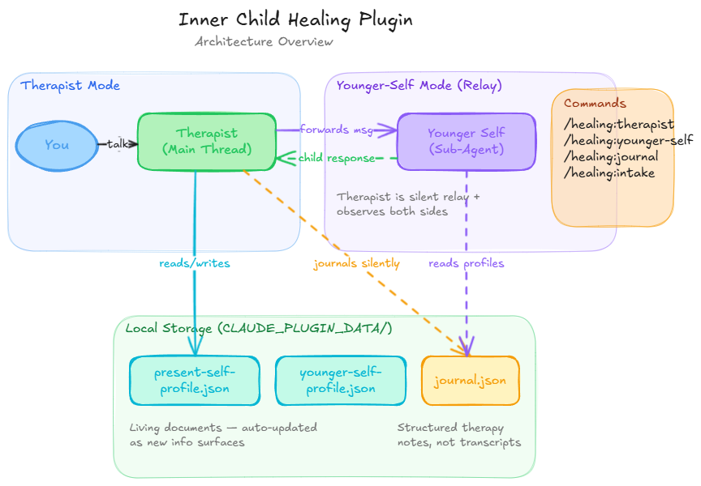

# Inner Child Healing

A Claude Code plugin that facilitates ongoing inner child healing work.

This is not a one-shot guided meditation or a worksheet. It's an ongoing therapeutic relationship between you (your present self) and your younger self, facilitated by an AI therapist who knows you, remembers you, and grows with you over time.

## How It Works

Install the plugin and just start talking. The therapist is always there — no command needed.

**First session:** The therapist gets to know you through natural conversation (not a form). It learns about your present self — what brings you here, your emotional landscape, how you cope — and about your younger self — who that child was, what they needed, what they didn't get. This is saved as your profile.

**Every session after:** The therapist remembers who you are, reads back through your journal, and picks up where you left off.

**Talking to your younger self:** When you're ready, you can talk directly to the child version of you. The child has their own personality and voice, built entirely from your story. They evolve based on your conversations — slowly, subtly, the way real healing works. The therapist steps back and silently relays messages between you and the child.

**Journaling:** Everything meaningful is captured automatically in the background. Emotional shifts, wounds touched, the child's evolving state, continuity notes for next session. You can review your journey anytime.

## Commands

| Command | What it does |
|---------|-------------|
| `/healing:therapist` | Start a therapist session, or return to the therapist from younger-self mode |
| `/healing:younger-self` | Talk directly to your younger self (use `/healing:therapist` to return) |
| `/healing:journal` | View your healing journey (`recent`, `all`, or `summary`) |
| `/healing:intake` | Update your profiles if your circumstances have changed |

You don't need to use commands to start. The therapist is the default — just talk.

## Architecture

### Overview

The plugin has three roles, all running on the same main thread:

1. **Therapist** (default) — The main personality. Always active. Handles intake, therapy sessions, and journaling.
2. **Younger Self** (sub-agent) — A separate agent with its own isolated context. Spawned by the therapist when you run `/healing:younger-self`. Has its own voice and personality, completely separate from the therapist.
3. **Journal Writer** — Not a separate agent. The therapist handles journaling directly, writing entries silently during both therapist and younger-self sessions.

### How It Flows



### How Younger-Self Mode Works

When you run `/healing:younger-self`:

1. The therapist reads your profiles and journal to compute the child's current emotional state
2. It spawns the younger-self agent (separate context, separate voice)
3. The therapist enters **relay mode** — it silently forwards your messages to the child agent and relays the child's responses back to you
4. You see only the child's words. The therapist adds no commentary.
5. Meanwhile, the therapist observes both sides and journals silently when something meaningful happens
6. When you run `/healing:therapist` or signal you're done, the therapist writes a final journal entry and returns

### Plugin Structure

```
inner-child-healing/
├── .claude-plugin/
│   └── plugin.json                    # Plugin manifest (name, version, author)
├── skills/
│   ├── therapist/
│   │   └── SKILL.md                   # Core therapist personality, knowledge base,
│   │                                  # intake logic, journaling, and relay protocol.
│   │                                  # This is the default mode — always active.
│   ├── journaling/
│   │   └── SKILL.md                   # Journal entry schema, when/what/where to write,
│   │                                  # profile update protocol.
│   └── younger-self-context/
│       └── SKILL.md                   # Data plumbing: reads profiles + journal,
│                                      # computes the child's current emotional state.
│                                      # Preloaded into the younger-self agent.
├── agents/
│   └── younger-self.md                # The child's character: personality rules,
│                                      # authenticity rules, evolution rules.
│                                      # Spawned by therapist during relay mode.
├── commands/
│   ├── therapist.md                   # /healing:therapist — start session or return
│   ├── younger-self.md                # /healing:younger-self — enter child relay mode
│   ├── journal.md                     # /healing:journal — view healing journey
│   └── intake.md                      # /healing:intake — update profiles
├── settings.json                      # Makes therapist the default agent on load
├── LICENSE
└── README.md
```

### Data Storage

All user data is stored locally in the plugin's persistent data directory (`${CLAUDE_PLUGIN_DATA}/`). Nothing is sent to external services.

| File | What it stores |
|------|---------------|
| `present-self-profile.json` | Who you are now — triggers, patterns, coping mechanisms, relationships, what brought you here |
| `younger-self-profile.json` | Who the child is — age, personality, environment, defense mechanisms, unmet needs |
| `journal.json` | Array of session entries — wounds touched, shifts observed, emotional states, continuity notes |

**Profiles are living documents.** They get updated automatically as new information surfaces during conversations.

**Journal entries** are structured therapeutic notes (not transcripts). Each entry captures:
- Date and session type (therapist or younger-self)
- Specific wounds touched
- Shifts observed (even micro-shifts)
- The child's current emotional state
- The user's current emotional state
- New profile information discovered
- Continuity notes for the next session

## Inspiration

The idea behind this plugin isn't new. Therapists and researchers have been doing inner child work for decades — we just tried to build a space where it can happen in conversation with yourself.

Here's where the ideas come from:

- **John Bradshaw** (*Homecoming*, 1990) brought inner child work into the mainstream. The idea that your wounded younger self carries unfinished business from childhood — and that you can go back and give them what they needed — starts here.
- **Richard Schwartz** created Internal Family Systems (IFS), which sees the mind as a family of parts — protective ones, wounded ones, and a core Self that can heal them. The younger-self agent in this plugin is essentially an IFS "exile" — the part that holds the pain.
- **Bessel van der Kolk** (*The Body Keeps the Score*) showed that trauma lives in the body, not just the mind. The therapist in this plugin draws from somatic awareness, not just talk.
- **Pete Walker** (*Complex PTSD: From Surviving to Thriving*) mapped emotional flashbacks, the inner critic, and the four trauma responses (fight, flight, freeze, fawn). His work directly informs how the therapist recognizes and works with patterns.
- **John Bowlby's** attachment theory — the idea that early bonds shape everything — is the foundation underneath all of this. Healing happens in relationship. That's why this plugin is built around an ongoing relationship, not a one-time exercise.
- **Carl Jung** started it all with the "Divine Child" archetype — the idea that reconnecting with your younger self is the path back to wholeness.

Others who shaped the thinking: Alice Miller (*The Drama of the Gifted Child*), Peter Levine (Somatic Experiencing), Gabor Mate (*The Myth of Normal*), Donald Winnicott (True Self/False Self), Jeffrey Young (Schema Therapy), and Janina Fisher (*Healing the Fragmented Selves of Trauma Survivors*).

This plugin doesn't replace therapy. But it tries to create a space where the work can happen.

## Design Principles

- **Privacy first** — all data stays on your machine
- **No template archetypes** — every younger self is unique, built from your profile
- **No predetermined growth arcs** — the child's evolution is driven entirely by your conversations
- **Subtle evolution** — the child never announces growth; shifts show through micro-behaviors only
- **Profiles evolve** — they are living documents updated as new information surfaces
- **Journaling is invisible** — you never trigger it; it happens silently during meaningful moments
- **The therapist adapts** — no default tone or framework; matches you and uses whatever the moment requires
- **The relationship is mutual** — present self and younger self heal each other

## Installation

### From GitHub

```bash
# Add the marketplace
claude plugin marketplace add saisurya96/inner-child-healing

# Install the plugin
claude plugin install healing@saisurya96-inner-child-healing
```

### Local Development

```bash
claude --plugin-dir /path/to/inner-child-healing
```

### Troubleshooting

**"Host key verification failed" during `plugin install`**

If you see this error:

```
Failed to clone repository: Host key verification failed.
fatal: Could not read from remote repository.
```

This means your machine doesn't have SSH keys configured for GitHub. The install command tries to clone via SSH, which fails without keys set up.

**Fix** — tell Git to use HTTPS instead of SSH for all GitHub repos:

```bash
git config --global url."https://github.com/".insteadOf "git@github.com:"
```

Then run the install command again. This is a one-time fix.

## Privacy

All your data stays on your machine. Profiles, journal entries, everything — stored locally in the plugin's data directory. Nothing is sent to external services. No external APIs. No cloud storage. No telemetry.

## License

MIT
